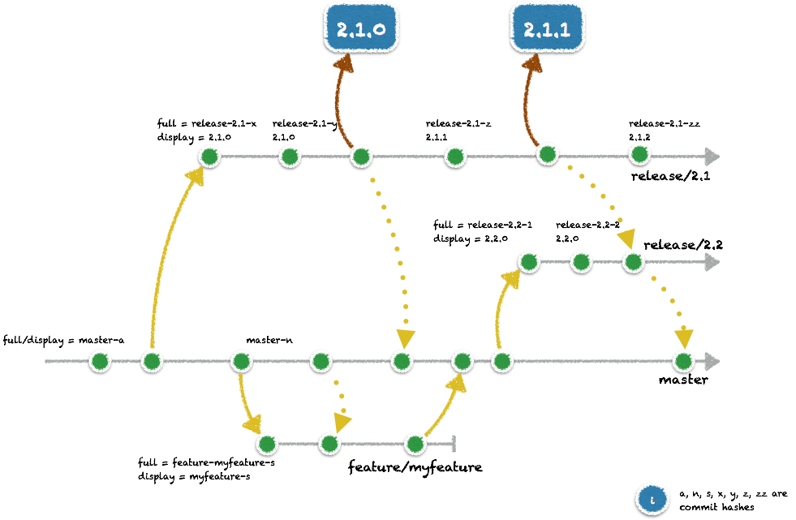
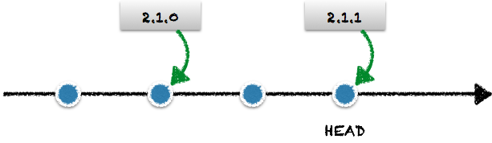

versioning
==========

Gradle plug-in to generate version information from the SCM branch.

## Use cases

Given a simple release workflow:



We get the version information from the branch in two flavours:

* the _full_ version, which is normalised branch name, followed by the short commit hash
* the _display_ version, which can be used to display the version to an end user, and is computed differently on a `feature/*` or `master` branch than on a `release/*` branch.

The computed project's _display_ version on the `feature/*` and `master` branches is the _base_ version (the normalised branch name without the prefix) and the abbreviated commit hash (or _build_ version). For `release/*` branches, the version is computed according the latest tag on the branch, allowing for automatic patch number.

To achieve such a configuration, just configure the `versioning` plug-in the following way and follow strict conventions for your branch names:

```groovy

allprojects {
   version = versioning.info.full
}

// Using versioning.info.display for generating property files for example
```

## Applying the plug-in

The `versioning` plug-in is hosted in [JCenter](https://bintray.com/bintray/jcenter) and is registered in the [Gradle Plug-in Portal](https://plugins.gradle.org/).

### Gradle 1.x and 2.0

```groovy
buildscript {
   repositories {
      jcenter()
   }
   dependencies {
      classpath 'net.nemerosa:versioning:1.1.0'
   }
}

apply plugin: 'net.nemerosa.versioning'
```

### Gradle 2.1 and higher

```groovy

plugins {
   id 'net.nemerosa.versioning' version '1.1.0'
}
```

## Using the versioning info

For example, to set the project's _full_ version using the SCM:

```groovy
allprojects {
   version = versioning.info.full
}
```

## Versioning info

Once the `versioning` plug-in has been applied, a `versioning` extension is available for the project.

Getting the read-only `ìnfo` provides access to the following information, computed from the SCM information:

Property | Description | Git: `master` | Git: `feature/great` | Git: `release/2.0`
---|---|---|---|---
`scm` | SCM source | `git` | `git` | `git`
`branch` | Branch name | `master` | `feature/great` | `release/2.0`
`branchType` | Type of branch | `master` | `feature` | `release`
`branchId` | Branch as an identifier | `master` | `feature-great` | `release-2.0`
`commit` | Full commit hash | `09ef6297deb065f14704f9987301ee6620493f70` | `09ef6297deb065f14704f9987301ee6620493f70` | `09ef6297deb065f14704f9987301ee6620493f70`
`build` | Short commit/revision indicator, suitable for a build number | `09ef629` | `09ef629` | `09ef629`
`full` | Branch ID and build | `master-09ef629` | `feature-great-09ef629` | `release-2.0-09ef629`
`base` | Base version for the display version | `` | `great` | `2.0`
`display` | Display version | `master` | `great` | `2.0.0`, `2.0.1`, ...

### Display version

The `display` version is equal to the `base` property is available or to the branch identifier.

For branches to type `release`, an additional computation occurs:

* if no tag is available on the branch which has the `base` as a prefix, the `display` version is the `base` version, suffixed with `.0`
* if a tag is available on the branch which has the `base` as a prefix, the `display` version is this tag, where the last digit is incremented by 1

By using the `display` version when tagging a release, the `display` version will be automatically incremented, patch after patch, using the `release` base at a prefix.

## Tasks

The `versioning` plug-in provides two tasks.

### `versionDisplay`

Displays the version information in the standard output. For example:

```bash
> ./gradlew versionDisplay
:versionDisplay
[version] scm        = git
[version] branch     = release/0.3
[version] branchType = release
[version] branchId   = release-0.3
[version] commit     = da50c50567073d3d3a7756829926a9590f2644c6
[version] full       = release-0.3-da50c50
[version] base       = 0.3
[version] build      = da50c50
[version] display    = 0.3.0
```

### `versionFile`

Creates a file which contains the version information. By default, the file is created at _build/version.properties_ and contains the following information:

``` bash
> ./gradlew versionFile
> cat build/version.properties
VERSION_BUILD = da50c50
VERSION_BRANCH = release/0.3
VERSION_BASE = 0.3
VERSION_BRANCHID = release-0.3
VERSION_BRANCHTYPE = release
VERSION_COMMIT = da50c50567073d3d3a7756829926a9590f2644c6
VERSION_DISPLAY = 0.3.0
VERSION_FULL = release-0.3-da50c50
VERSION_SCM = git
```

The `versionFile` task can be customised with two properties. The defaults are given below:

```groovy
versionFile {
   // Path to the file to be written
   file = new File(project.buildDir, 'version.properties')
   // Prefix to apply to the properties
   prefix = 'VERSION_'
}
```

## Customisation

The collection of the versioning info can be customised by setting some properties in the `versioning` extension.

The default properties are shown below:

```groovy
versioning {
   /**
    * Defines the SCM to use in order to collect information.
    *
    * At the moment, only Git (git) and Subversion (svn) are supported.
    */
   scm = 'git'
   /**
    * Computation of the branch type and the base, by parsing the branch name.
    * By default, we use "/" as a separator between the type and the base. If not
    * present, the type is the branch and the base is empty.
    */
    branchParser = { String branch, String separator = '/' ->
        int pos = branch.indexOf(separator)
        if (pos > 0) {
            new BranchInfo(
               type: branch.substring(0, pos),
               base: branch.substring(pos + 1))
        } else {
            new BranchInfo(type: branch, base: '')
        }
    }
    /**
     * Computation of the full version
     */
    full = { branchId, abbreviated -> "${branchId}-${abbreviated}" }
    /**
     * Set of eligible branch types for computing a display version from the branch base name
     */
    releases = ['release']
}
```

### Dirty versions

The behaviour of the version computation is slightly different when the working
copy is dirty - meaning that the working copy contains some files which are not
staged or not committed.

When the working copy the version is computed from, the default behaviour is to
append the `-dirty` suffix to the `display` and `full` version.

This can be customised with the following ettaributes on the `versioning` extension:

```groovy
versioning {

   /**
   * Dirty mode.
   *
   * Closure that takes a version (display or full) and processes it to produce a <i>dirty</i>
   * indicator. By default, it appends the dirtySuffix value to the version.
   */
   dirty = { version -> "${version}${dirtySuffix}" }

   /**
   * Default dirty suffix
   */
   dirtySuffix = '-dirty'

   /**
   * If set to true, the build will fail if working copy is dirty and if the branch type is
   * part of the releases list ("release" only by default).
   */
   dirtyFailOnReleases = false
}
```

### Snapshots on release branches

Sometimes, you do not want to have the `display` version for a _release_ branch being the next tag if you are already on a tag.

By default, the `versioning` plug-in will behave correctly if you tag only as the very end of your delivery pipeline,
when the project is actually delivered. But if you want to tag upfront, you probably need to indicate that your `display` version
is a _snapshot_ or similar (see issue [#19|https://github.com/nemerosa/versioning/issues/19] for the discussion).

In such a case, you can specify a `snapshot` release mode:

```groovy
versioning {
   releaseMode = 'snapshot'
}
```

In this case, if the `HEAD` is not _exactly_ associated with a tag, the `-SNAPSHOT` string will be appended to the `display` version. For example, if there is a previous tag `2.1.0`, then the `display` version will be `2.1.1-SNAPSHOT`. But if the `HEAD` is exactly on the `2.1.0` tag, then the `display` version is also `2.1.0`.

You can customise the `-SNAPSHOT` suffix used the `snapshot` property:

```groovy
versioning {
   releaseMode = 'snapshot'
   snapshot = '.DEV'
}
```

Note that the default `releaseMode` is `tag`, where the next tag is always used as a `display` version.

You can also customise completely the computation of the `display` version for a release by setting the `releaseMode` to a `Closure`:

```groovy
versioning {
   releaseMode = { nextTag, lastTag, currentTag, extension ->
       "${nextTag}"
   }
}
```

The meaning of the parameters is illustrated by the diagrams below:



* `nextTag` = `2.1.2` - computed
* `lastTag` = `2.1.1` - last tag from the `HEAD`
* `currentTag` = `2.1.1` - exact tag for the `HEAD`


* `nextTag` = `2.1.1` - computed
* `lastTag` = `2.1.0` - last tag from the `HEAD`
* `currentTag` = none - exact tag for the `HEAD`

The `extension` parameter is the content of the `versioning` configuration object.

## Subversion support

Subversion is supported starting from version `1.1.0` of the Versioning plug-in. In order to enable your working copy
to work with Subversion, set `scm` to `svn`:

```groovy
versioning {
   scm = 'svn'
}
```

The branches are read from under the `branches/` folder and the branch type is parsed
using '-' as a separator. The table below gives some examples for Subversion based branches:


Property | Description | SVN: `trunk` @ rev 12 | SVN: `branches/feature-great` @ rev 12 | SVN: `branches/release-2.0` @ rev 12
---|---|---|---|---
`scm` | SCM source | `svn` | `svn` | `svn`
`branch` | Branch name | `trunk` | `feature-great` | `release-2.0`
`branchType` | Type of branch | `trunk` | `feature` | `release`
`branchId` | Branch as an identifier | `trunk` | `feature-great` | `release-2.0`
`commit` | Revision | `12` | `12` | `12`
`build` | Revision | `12` | `12` | `12`
`full` | Branch ID and build | `master-12` | `feature-great-12` | `release-2.0-12`
`base` | Base version for the display version | `` | `great` | `2.0`
`display` | Display version | `trunk` | `great` | `2.0.0`, `2.0.1`, ...

The rules for the display mode remain the same ones than for Git.

## Release

The CI and release jobs are available in the [Nemerosa Jenkins](https://jenkins.nemerosa.net/job/versioning/).

See http://plugins.gradle.org/submit for the publication on the [Gradle Plug-in Portal](https://plugins.gradle.org/).

## Windows support

As of version 1.2, Windows is not supported for building and testing.

The tests rely on the local creation of Git and Subversion repositories, and such creation rely heavily on
 shell commands and processes manipulation.

Unless mentioned otherwise, _using_ the Versioning plug-in on Windows should be OK.
